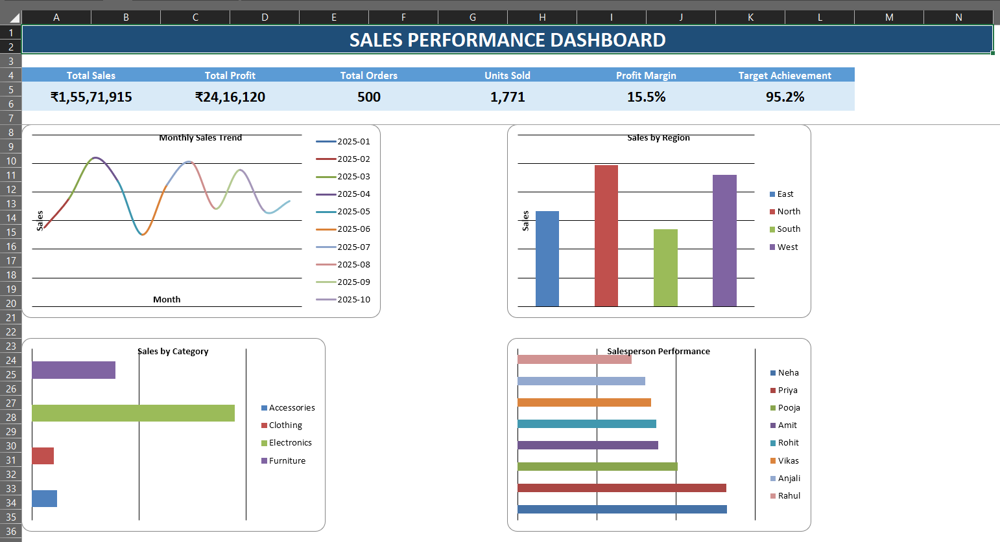

# Sales Performance Dashboard

## Project Overview
An interactive **Sales Performance Dashboard** built in Microsoft Excel to analyze sales, profit, orders, products, regions, and salesperson performance.

## Tools & Technologies
- Microsoft Excel
- Power Query
- Pivot Tables
- Pivot Charts
- KPI Cards
- Excel Charts
- ## 📊 Dashboard Preview

- Slicers / Filters

## Dataset
The project uses **500 synthetic sales transactions** containing Order ID, Order Date, Customer, Region, State, Category, Product, Quantity, Discount, Sales, Profit, Salesperson, and Payment Mode.

## Project Workflow
**Raw Data → Power Query → Data Cleaning → Clean Data → Pivot Analysis → KPIs → Charts → Dashboard**

## Dashboard KPIs
- Total Sales
- Total Profit
- Total Orders
- Units Sold
- Profit Margin
- Target Achievement

## Dashboard Analysis
- Monthly Sales Trend
- Sales by Region
- Sales by Category
- Salesperson Performance
- Top Products
- Profitability

## Key Skills Demonstrated
- Data Cleaning & Transformation
- Exploratory Data Analysis
- Excel Pivot Tables
- Dashboard Development
- KPI Reporting
- Data Visualization
- Business Insights

## Project Files
| File | Description |
|---|---|
| `Sales_Performance_Dashboard.xlsx` | Main Excel dashboard and analysis workbook |
| `Sales_Performance_Raw_Data.csv` | Raw sales dataset |

## How to Use
1. Download `Sales_Performance_Dashboard.xlsx`.
2. Open it in Microsoft Excel.
3. Review the **Dashboard** sheet.
4. Explore the **Clean Data** and **Pivot Summary** sheets.
5. Use the Power Query Guide for the transformation workflow.

## Portfolio Note
This project was created for **Data Analyst portfolio and job application purposes** to demonstrate practical Excel-based data analysis and dashboard development.

## Author
**Abhishek Sharma**

Aspiring Data Analyst | Excel | SQL | Python | Data Visualization

